# 🚀 Army-Surveillance-Enhancer 🔍

<p align="center">
    
</p>

**🚀 Army-Surveillance-Enhancer** introduces novel models designed from scratch to address the dual challenges of **detecting and enhancing pixelated images** with **exceptional speeds**. The proposed detection model, leveraging **MobileNet_v3_small combined with Canny edge detection**, demonstrates significant improvements over baseline methods on datasets like **Div2K** and **Flickr2K**. This model achieves higher precision, recall, F1 score, and accuracy while maintaining a lower false positive rate. Despite a slightly reduced speed compared to the baseline, the model remains efficient, operating at **3505 FPS**. ⚡

For image correction, the project introduces **MiniSRGAN**, a novel variant of SRGAN. **MiniSRGAN** showcases enhanced performance in terms of PSNR, SSIM, LPIPS metrics, and speed compared to traditional methods like Bicubic and other deep learning approaches (such as EDSR, FSRCNN, and SRGAN). **MiniSRGAN** strikes a balance between visual quality and computational efficiency, operating at **21 FPS** with a compact model size of **3.605 MB**. 🖼️✨

Both models were implemented entirely from scratch and are hosted on HuggingFace for accessibility, although optimal performance is observed with GPU-based execution. 

<p align="center">
    
</p>

## :bookmark_tabs: Table of Contents

- [Try It Yourself](#fire-try-it-yourself-fire)
- [Results](#results)
- [Model Architecture](#architecture)
- [Training and Testing Dataset Details](#training-and-testing-dataset-details)
- [Training Details](#training-details)
- [Requirements](#requirements)
- [Inference: Detection](#inference-detection)
- [Inference: Correction](#inference-correction)
- [Directory Structure](#directory-structure)
- [Future Work](#future-work)
- [Contributing](#contributing)

---

## :star: Results

**The performance of these models was tested on RTX 3060 Mobile GPU.**

###  <ins>Detection Results: </ins>

#### MobileNet_v3_small + Canny Edge Detection

**Datasets used for testing:**

- Div2K (Full dataset - 900 images)
- Flickr2K (Test split - 284 images)

**Performance:**

The baseline model was not evaluated on the Div2K dataset due to its poor performance on the Flickr2K validation/test set.

#### Comparison of Proposed Method vs Baseline

##### Metrics on Flickr2K's test set

| Metric           | Proposed Method on Flickr2K | Baseline on Flickr2K  |
|------------------|-----------------------------|-----------------------|
| **Precision**    | 0.944                       | 0.5648                |
| **Recall**       | 0.9007633                   | 0.4326                |
| **F1 Score**     | 0.921875                    | 0.4899                |
| **Accuracy**     | 0.9300595                   | 0.5556                |
| **False Positives** | 4.58%                    | 32.867%               |
| **Speed**        | 3505 FPS                    | 3522 FPS              |
| **Model Size**   | 5.844 MB                    | 5.844 MB              |

#### Confusion Matrices:

<p float="left">
   <h3>Proposed Method:</h3>
  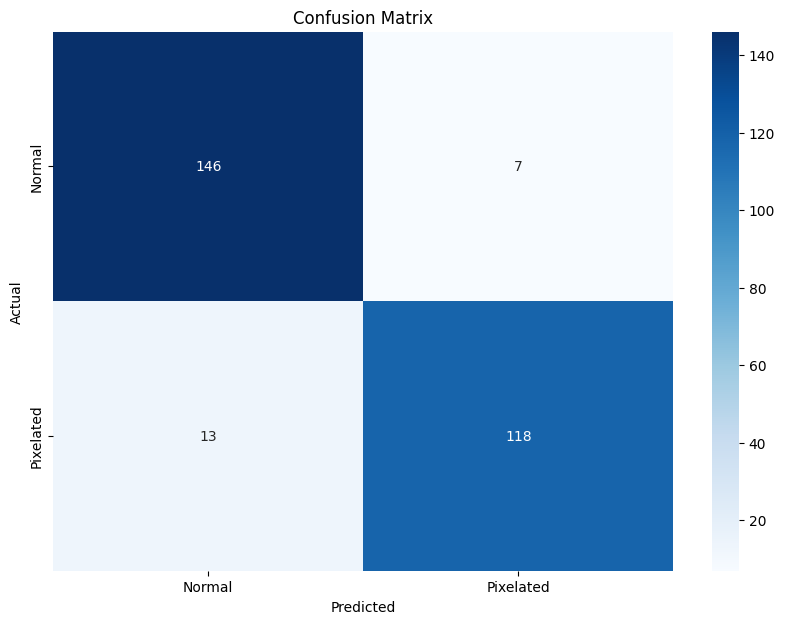
  <h3>Baseline:</h3>
  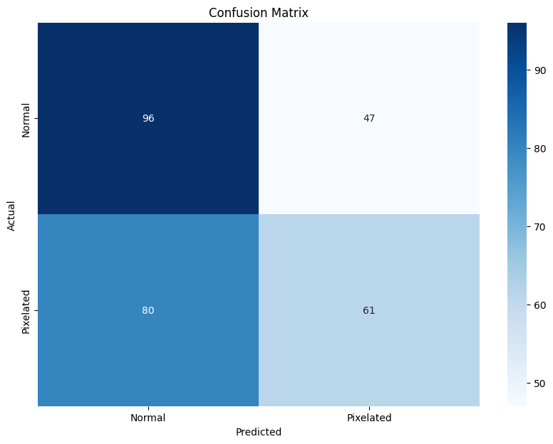
</p>

##### Metrics on Div2K

| Metric           | Proposed Method on Div2K |
|------------------|--------------------------|
| **Precision**    | 0.9084967                |
| **Recall**       | 0.9084967                |
| **F1 Score**     | 0.9084967                |
| **Accuracy**     | 0.9046053                |
| **False Positives** | 9.52%                 |
| **Speed**        | 3505 FPS                 |
| **Model Size**   | 5.844 MB                 |

#### Confusion Matrix:

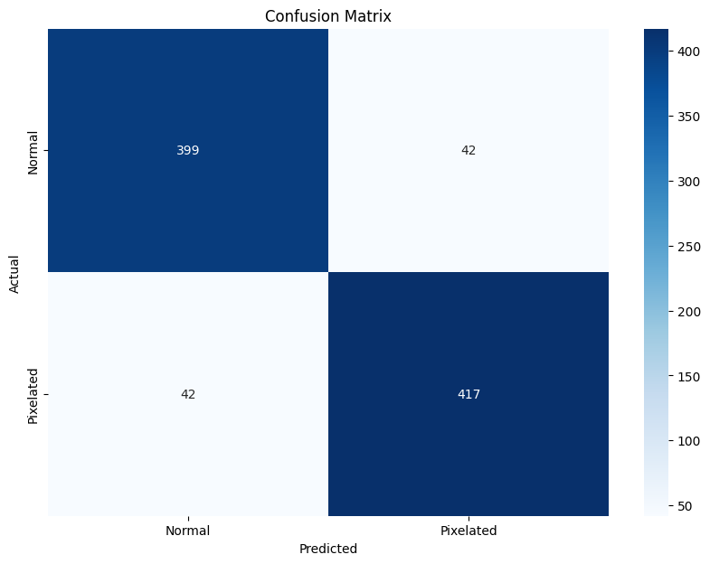

### Summary

The proposed method outperforms the baseline significantly across all evaluation metrics on the Flickr2K dataset. It achieves higher precision, recall, F1 score, and accuracy while maintaining a much lower false positive rate. The model size remains consistent across both methods.

Overall, the proposed method demonstrates superior performance and is a clear improvement over the baseline, especially in terms of accuracy and reliability.

---

###  <ins>Correction Results (MiniSRGAN): </ins>

**MiniSRGAN** is proposed as a high-performance image correction model in super-resolution tasks. It balances visual quality and computational efficiency, making it ideal for real-time applications such as surveillance and military operations.

#### Comparison of Image Super-Resolution Methods (Evaluated on Set5)

| Metric            | Bicubic (Baseline)      | MiniSRGAN (Proposed)      | SRGAN                    | EDSR                     | FSRCNN                   |
|-------------------|-------------------------|---------------------------|---------------------------|--------------------------|--------------------------|
| PSNR              | 27.76 dB                | 30.13 dB                  | 29.99 dB                  | 31.78 dB                 | 30.52 dB                 |
| SSIM              | 0.7806                  | 0.8340                    | 0.8176                    | 0.8895                   | 0.8548                   |
| LPIPS             | 0.3658                  | 0.1264                    | 0.1118                    | 0.1922                   | 0.2013                   |
| Speed (FPS)       | -                       | 21                        | 12                        | 16                       | 188                      |
| Model Size (MB)   | -                       | 3.605                     | 5.874                    | 5.789                    | 0.049                    |

**Sample Output:**

***1) Top Row: Input, Middle Row: Output, Bottom Row: Target (MiniSRGAN)***


Close up (MiniSRGAN):
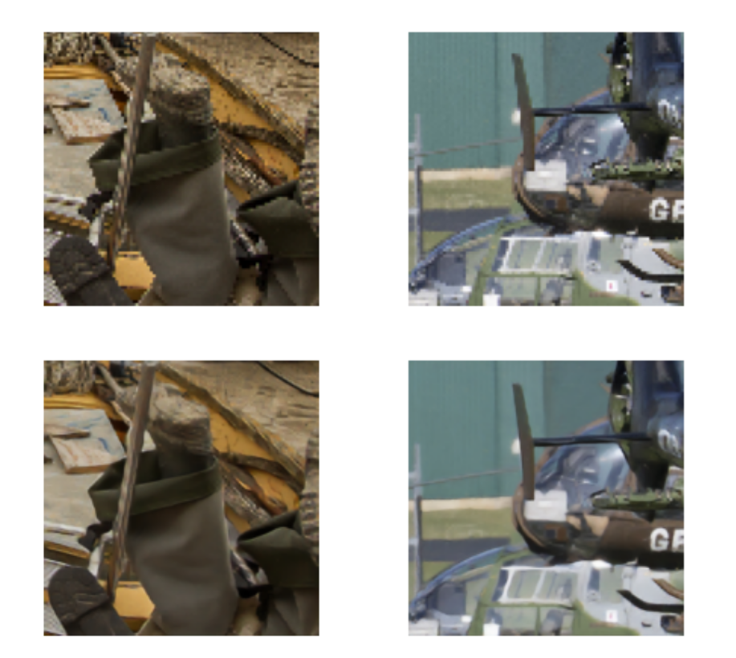

---

## Architecture

### Detector Architecture:

The detector architecture is built upon **MobileNet_v3_small** combined with **Canny Edge Detection**, a lightweight and efficient neural network architecture. This model is well-suited for edge devices with limited computational power.

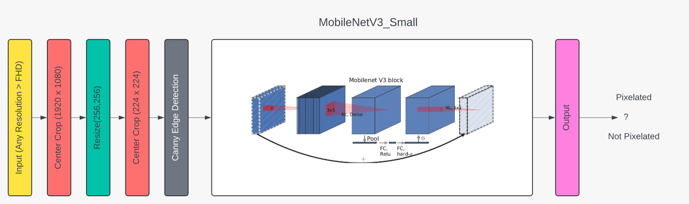

### MiniSRGAN Architecture:

The architecture of **MiniSRGAN** features 8 residual blocks (B = 8), optimized for enhanced image quality with minimal computational overhead. It effectively generates high-resolution images from low-resolution inputs, offering a good trade-off between speed and performance.


The architecture focuses on residual learning to capture finer details and is lightweight enough to run efficiently on modern GPUs.

---

## Training and Testing Dataset Details

### Detector Training

The detector was trained on the train split of the **Flickr2K** dataset, which consists of 2,200 images. The Flickr2K dataset was chosen due to its variety of high-quality images, providing a robust training environment for the detection model.

#### Detector Testing

The detector was tested in two phases:
1. **Test split of the Flickr2K dataset**: Consisting of 284 images, the test set was used to validate the model's performance on unseen data.
2. **Full dataset of Div2K**: The full Div2K dataset (train + val) was used to ensure that the test images were entirely independent of the trained dataset, offering a comprehensive evaluation.

### Super Resolution Model Training (MiniSRGAN)

**MiniSRGAN** was trained on a subset of the **Div2K** dataset, consisting of 800 images. The Div2K dataset is widely used for super-resolution tasks due to its high-quality images, making it an ideal choice for training models like MiniSRGAN.

### Testing of Proposed SR Models

The testing of the **MiniSRGAN** model was conducted on the **Set5** dataset. This dataset is a standard benchmark in the field of super-resolution and provides a clear comparison with other models.

---

## Training Details

### Detector:

**Problem:**

The models, when trained on the COCO dataset (subset with ~21k images), performed poorly with HD images.

**Solution

:**

The dataset used for training was enriched with images exceeding 1920x1080 resolution.

**Reasoning:**

Resizing an image from a higher resolution (e.g., HD) to a smaller size (224x224) retains more information compared to resizing a lower resolution image to the same size. This additional information during training presumably helped the model generalize better to handle HD images during inference.

**Additional Preprocessing:**

The images undergo other standard preprocessing steps like **Canny Edge Detection** before being fed into the model.

### Generator:

No specialized training was conducted; models were trained using regular methods to generate images four times the size of the input. Preprocessing for **MiniSRGAN** was already completed using the Div2K dataset.

---

## Requirements

Install the necessary libraries:

```sh
pip install -r requirements.txt
```

## :stop_sign: IMPORTANT!!!!!!!

When running **locally**, ensure you use only the versions of libraries mentioned in `requirements.txt`. Significant and incorrect differences in results can occur when using different versions.

---

## Inference: Detection

To run the detection app, use the following command:

```sh
python detect_app.py
```

You will see the following output:

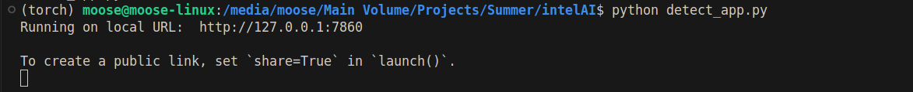

Open the provided link in any web browser to access the interface:

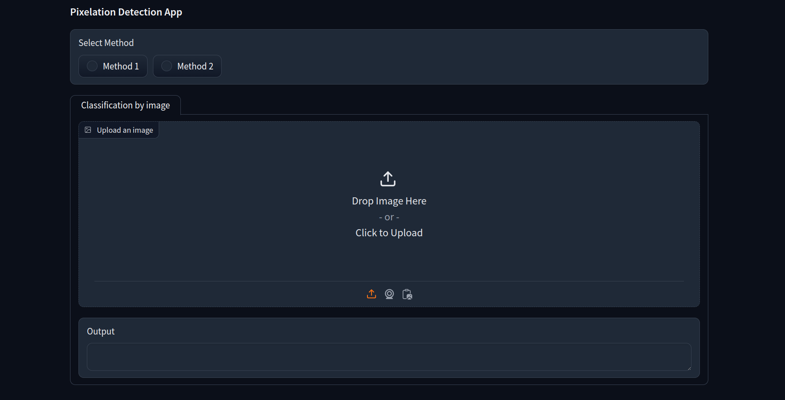

Select the method and proceed with uploading an image to detect if it is pixelated.

**Methods:**

- Method 1: **MobileNetV3_Small**
- Method 2 (Proposed method): **MobileNetV3_Small + Canny Edge Detection**

Example:

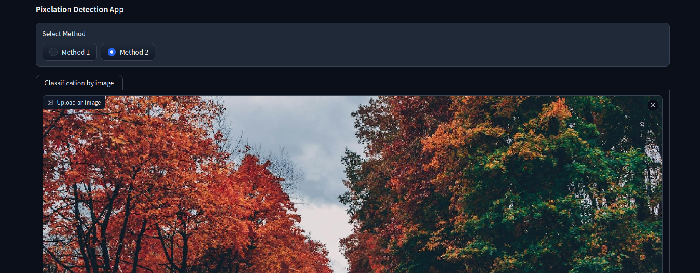

The result will appear as soon as you upload the image:

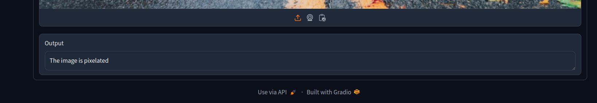

---

## Inference: Correction

To run the correction app, use the following command:

```sh
python correct_app.py
```

You will see the following output:

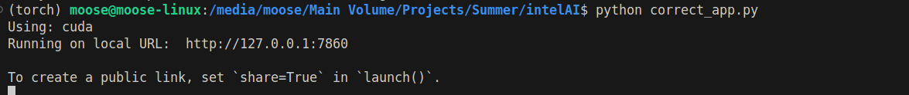

Open the provided link in any web browser to access the interface:

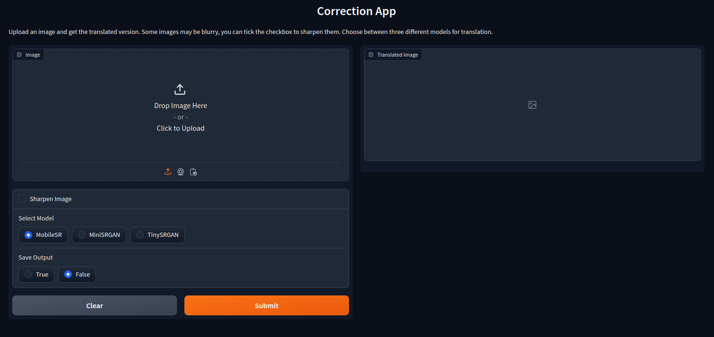

Upload an image and click submit!

Example:

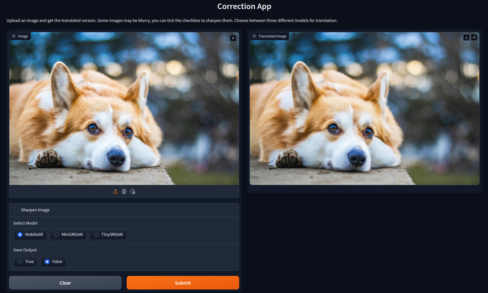

---

## Directory Structure

```plaintext
├── training_detection
│   ├── detection_method_1_Pixelated.ipynb    - Training notebook for detection method 1 (baseline)
│   └── detection_method_2_Pixelated.ipynb    - Training notebook for detection method 2 (proposed method)
│
├── training_correction
│   ├── training_miniSRGAN.ipynb              - Scripts for training correction models (MiniSRGAN)
│
├── testing_correction
│   ├── Testing_Correction_Result.ipynb       - Notebook for obtaining images/sr_result.png and images/sr_closeup.png for MiniSRGAN
│   ├── model_evaluation_set5.ipynb           - Notebook for evaluating all models on the Set5 dataset
│   ├── model_inference_set5.ipynb            - Notebook for performing inference on the Set5 dataset
│   └── super_resolved_Set5_images_miniSRGAN  - Directory containing images obtained from inference
│
├── testing_detection
│   └── test_detect.ipynb                     - Test notebook for detection method 2 (proposed method)
│
├── time_calculation
│   └── time_calculation_miniSRGAN.ipynb      - Time measurement notebook for MiniSRGAN
|
├── model_size_calculation
│   └── model_size_miniSRGAN.ipynb            - Model size measurement notebook for MiniSRGAN
│
├── images                                    - Directory containing readme.md images
│
├── weights                                   - Directory containing weights of the trained model
│
├── detect_app.py                             - Detection inference app.py file
│
└── correct_app.py                            - Correction inference app.py file
```

---

## Future Work

July 05, 2024: <s> Making a pipeline which will detect and correct in the same app </s>

---

## Contributing

Any kind of enhancement or contribution is welcomed!

---
