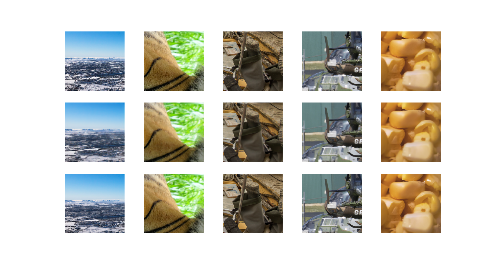
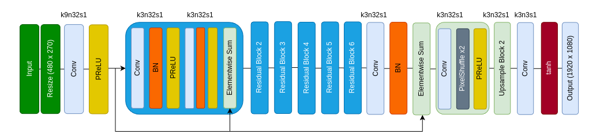
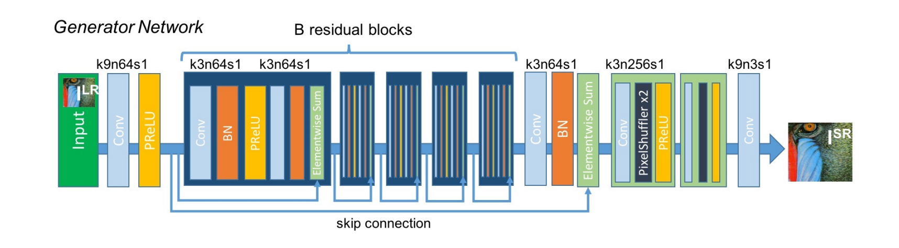

# 🚀 Army-Surveillance-Enhancer

**Army-Surveillance-Enhancer** introduces novel models designed from scratch to address the dual challenges of **detecting and enhancing pixelated images** with **exceptional speeds**. The proposed detection model, leveraging **MobileNet_v3_small combined with Canny edge detection**, demonstrates significant improvements over baseline methods on datasets like **Div2K** and **Flickr2K**. This model achieves higher precision, recall, F1 score, and accuracy while maintaining a lower false positive rate. Despite a slightly reduced speed compared to the baseline, the model remains efficient, operating at **3505 FPS**. ⚡

For image correction, the project introduces three new novel variants of SRGAN, namely **MiniSRGAN** and **TinySRGAN**. These models showcase enhanced performance in terms of PSNR, SSIM, and LPIPS metrics, and speed compared to traditional methods like Bicubic and other deep learning approaches (such as EDSR, FSRCNN, and SRGAN). MiniSRGAN and TinySRGAN strike a balance between visual quality and computational efficiency, operating at **21 FPS** and **48 FPS!!!** respectively, with a compact model size of **3.605 MB** and **0.780 MB**. 🖼️✨

Both models were implemented entirely from scratch and are hosted on HuggingFace for accessibility, although optimal performance is observed with GPU-based execution.

<p align="center">
    
</p>

## :bookmark_tabs: Table of Contents

- [Try It Yourself](#fire-try-it-yourself-fire)
- [Results](#results)
- [Model Architecture](#architecture)
- [Training and Testing Dataset Details](#training-and-testing-dataset-details)
- [Training Details](#training-details)
- [Requirements](#requirements)
- [Inference: Detection](#inference-detection)
- [Inference: Correction](#inference-correction)
- [Directory Structure](#directory-structure)
- [Future Work](#future-work)
- [Contributing](#contributing)

## :star: Results

**The performance of these models was tested on an RTX 3060 Mobile GPU.**

### <ins>Detection Results:</ins>

#### MobileNet_v3_small + Canny Edge Detection

**Datasets used for testing:**

- Div2K (Full dataset - 900 images)
- Flickr2K (Test split - 284 images)

**Performance:**

The baseline model was not evaluated on the Div2K dataset due to its poor performance on the Flickr2K validation/test set.

### Comparison of Proposed Method vs Baseline

#### Metrics on Flickr2K's test set

| Metric             | Proposed Method on Flickr2K | Baseline on Flickr2K |
|--------------------|-----------------------------|----------------------|
| **Precision**       | 0.944                       | 0.5648               |
| **Recall**          | 0.9007633                   | 0.4326               |
| **F1 Score**        | 0.921875                    | 0.4899               |
| **Accuracy**        | 0.9300595                   | 0.5556               |
| **False Positives** | 4.58%                       | 32.867%              |
| **Speed**           | 3505 FPS                    | 3522 FPS             |
| **Model Size**      | 5.844 MB                    | 5.844 MB             |

### Confusion Matrices:

<p float="left">
   <h3>Proposed Method:</h3>
   
   <h3>Baseline:</h3>
   
</p>

#### Metrics on Div2K

| Metric             | Proposed Method on Div2K  |
|--------------------|--------------------------|
| **Precision**       | 0.9084967                |
| **Recall**          | 0.9084967                |
| **F1 Score**        | 0.9084967                |
| **Accuracy**        | 0.9046053                |
| **False Positives** | 9.52%                    |
| **Speed**           | 3505 FPS                 |
| **Model Size**      | 5.844 MB                 |

### Confusion Matrix:


### Summary

The proposed method outperforms the baseline significantly across all evaluation metrics on the Flickr2K dataset. It achieves higher precision, recall, F1 score, and accuracy, while maintaining a much lower false positive rate. The model size remains consistent across both methods.

### <ins>Correction Results:</ins>

### Comparison of Image Super-Resolution Methods (Evaluated on Set5)

| Metric            | Bicubic (Baseline)      | MiniSRGAN (Proposed)      | TinySRGAN (Proposed)      | MiniSRResNET              | SRGAN                    | EDSR                     | FSRCNN                   |
|-------------------|-------------------------|---------------------------|---------------------------|---------------------------|--------------------------|--------------------------|--------------------------|
| PSNR              | 27.76 dB                | 30.13 dB                  | 30.64 dB                  | 31.76 dB                  | 29.99 dB                 | 31.78 dB                 | 30.52 dB                 |
| SSIM              | 0.7806                  | 0.8340                    | 0.8576                    | 0.8829                    | 0.8176                   | 0.8895                   | 0.8548                   |
| LPIPS             | 0.3658                  | 0.1264                    | 0.1554                    | 0.1928                    | 0.1118                   | 0.1922                   | 0.2013                   |
| Speed (FPS)       | -                       | 21                        | 48                        | 21                        | 12                       | 16                       | 188                      |
| Model Size (MB)   | -                       | 3.605                     | 0.780                     | 3.605                     | 5.874                    | 5.789                    | 0.049                    |

**Sample Output:**

***1) Top Row: Input, Middle Row: Output, Bottom Row: Target (MobileSR)***



Close up (MobileSR):


## Architecture

### Detector Architecture:


### TinySRGAN Architecture:



### MiniSRGAN/MiniSRResNet Architecture:

Here B = 8 (for 8 residual blocks)



## Training and Testing Dataset Details

#### Detector Training

The detector was trained on the train split of the Flickr2K dataset, which consists of 2,200 images.

#### Super Resolution Model Training (MiniSRGAN & TinySRGAN)

These models were trained on the Div2K dataset (800 images).

#### Testing of Proposed SR Models

The testing of the super resolution model was done on the [Set5](https://figshare.com/articles/dataset/BSD100_Set5_Set14_Urban100/21586188) dataset.

## Training Details

### Detector:
**Problem**: Models trained on the COCO dataset performed poorly with HD images.

**Solution**: The dataset used for training was enriched with images exceeding 1920x1080 resolution.

### Generator:
The models were trained using regular methods to generate images four times the size of the input. Preprocessing for MobileSR was performed dynamically during training.

## Requirements

Install the necessary libraries:

```bash
pip install -r requirements.txt
```

## Inference: Detection

Run the detection app with:

```bash
python detect_app.py
```

Open the provided link in any browser to access the interface.

## Inference: Correction 

Run the correction app with:

```bash
python correct_app.py
```

Open the provided link in any browser to access the interface.

## Directory Structure

```plaintext
├── training_detection
├── training_correction
├── testing_correction
├── testing_detection
├── time_calculation
├── model_size_calculation
├── experiment_detection  
├── image
├── image_analysis
├── sample2_correction_model_results
├── weights
├── detect_app.py
└── correct_app.py
```
## Team Members

- Garv Bhaskar
- Kshitij Kumar
- Aviral Srivastava
- Shipli Anand

## Mentor

- Verjin Raja Sarobin

---
## Contributing

Any kind of enhancement or contribution is welcomed!

---
